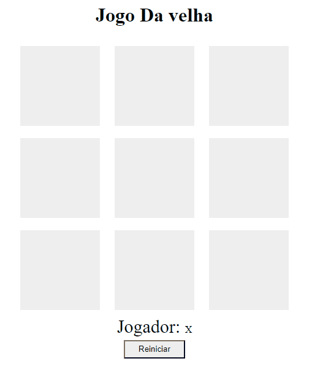
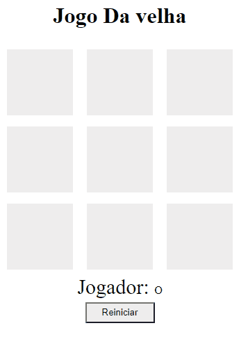

# Jogo da Velha-DIO

Projeto do Jogo da velha para você jogar no browser!
O jogo foi pensado para dois jogadores se enfrentarem, você pode clicar no link abaixo e jogar ele imediatamente, o jogo também foi preparado para funcionar no mobile via media queries!

## Sobre o desenvolvimento do Projeto
Alguns dos diferenciais desse para o projeto mostrado pelo especialista na dio são.
 - Uso de event listener para facilitar o desenvolvimento e manutenção do código
 - Redução do número de variáveis ao usar o conceito de arrays
 - Responsividade considerando dispositivos mobile

[Site Do Projeto](https://martvie.github.io/jogo-da-velha-DIO/)

## imagens do projeto
### Versão Desktop

### Versão Mobile

## Tecnologias utilizadas

* JavaScript
* HTML
* CSS
